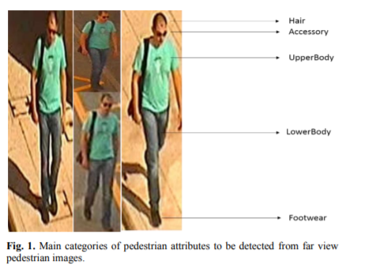
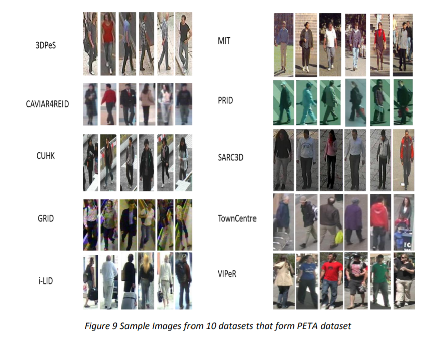
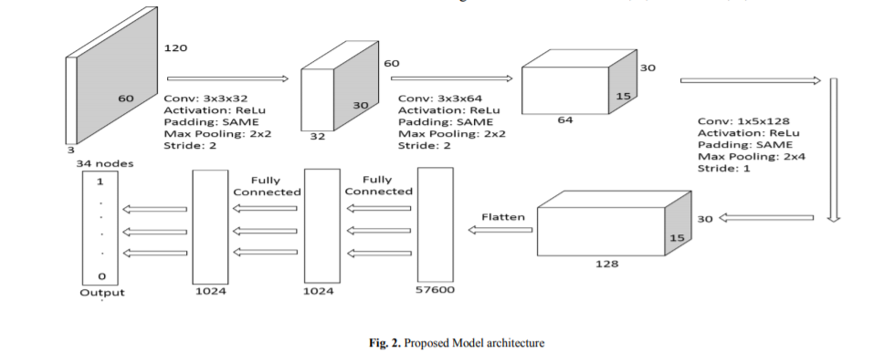
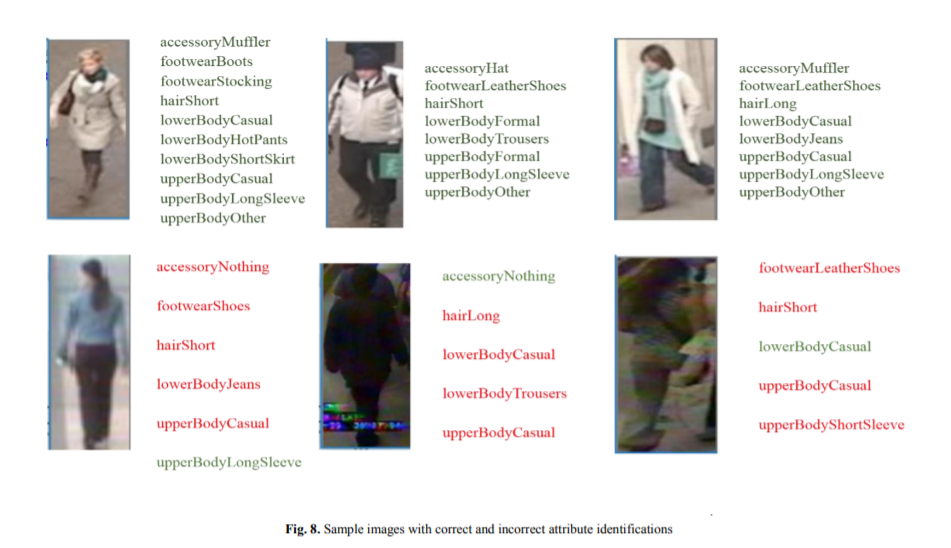

# Pedestrian-Attribute-Detection
We address the pedestrian attribute recognition from far view images task as a multi label single class classification problem and approach it with a specialized convolutional neural network model that achieves an overall accuracy of 90.16% for 34 pedestrian clothing attributes including hair as defined in the PETA dataset which consists of far-view images. We compare the recognition accuracy of the attributes that were previously worked with in some of the previous CNN models. Our model outperforms these previous models in the overall accuracy and for more than half of the attributes. 

This work was done using the deep learning framework Tensorflow in the Google Colaboratory Jupyter Notebook Environment.
A paper for this project has been published at ICCCNT 2019. The link is - https://ieeexplore.ieee.org/document/8944776

The following screenshots are some of the images from the paper

